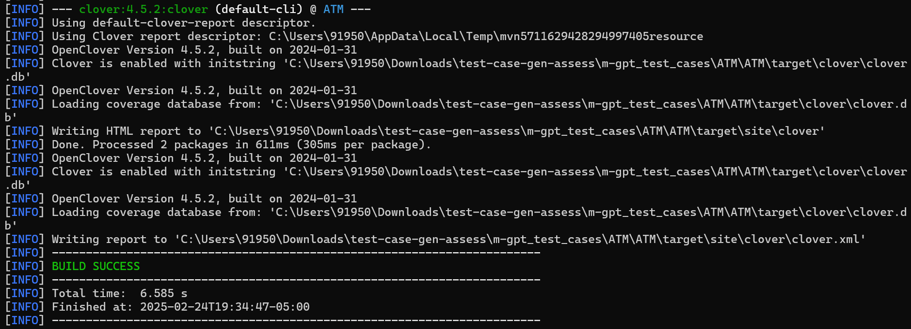
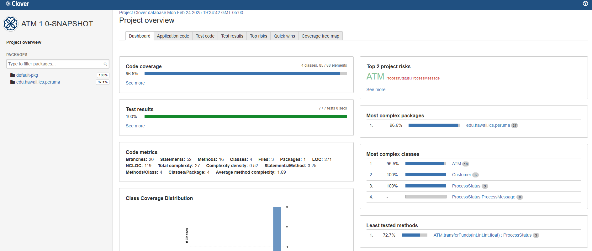
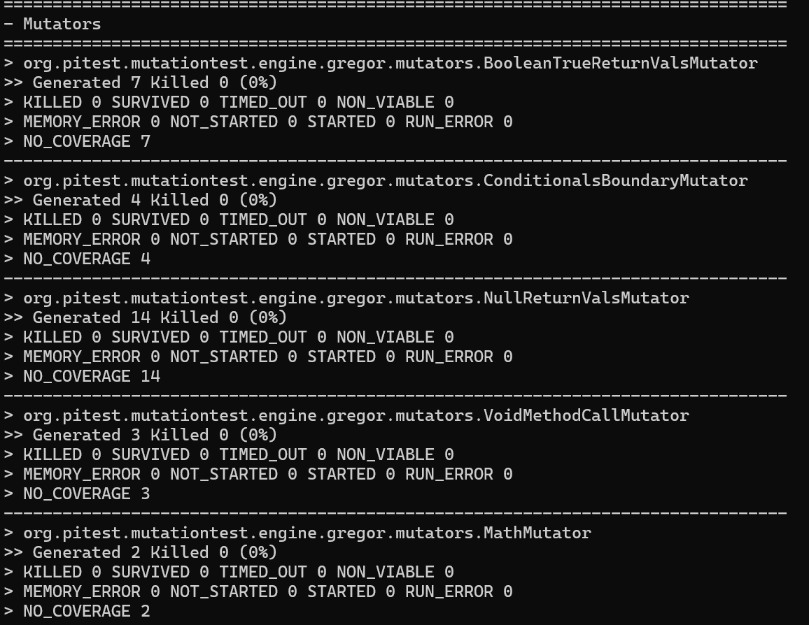
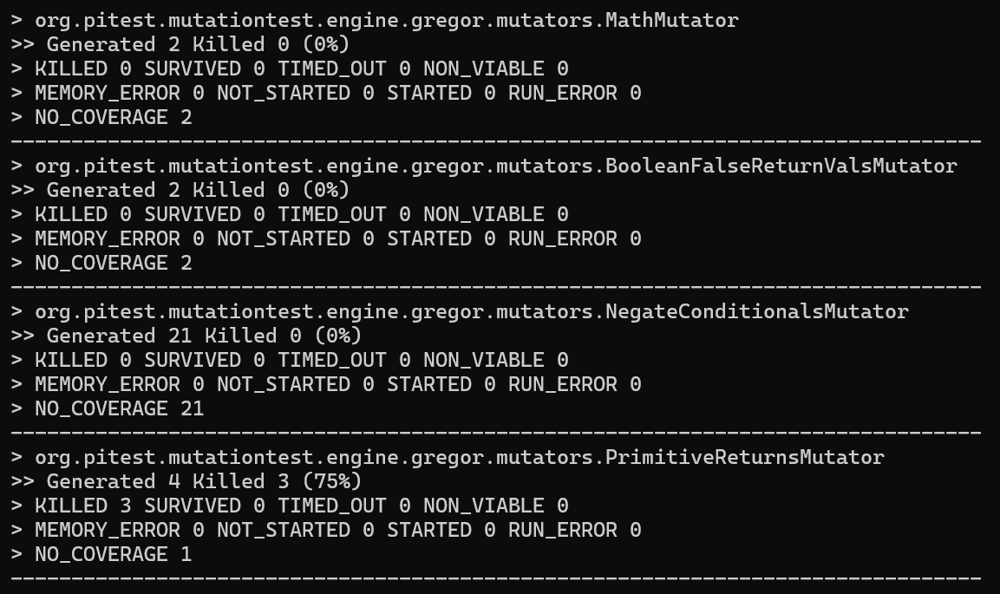
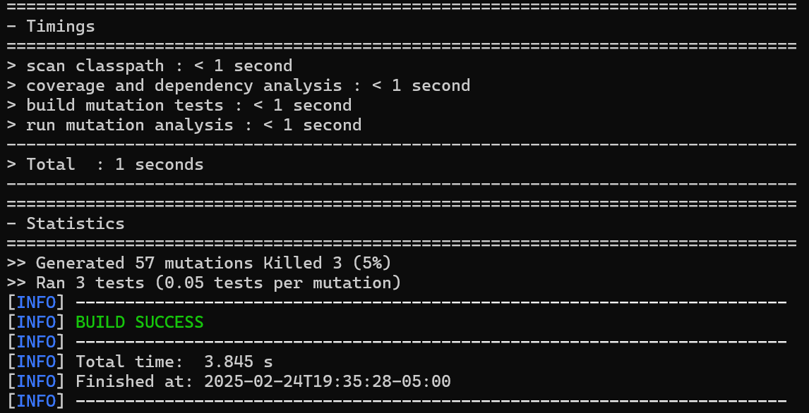
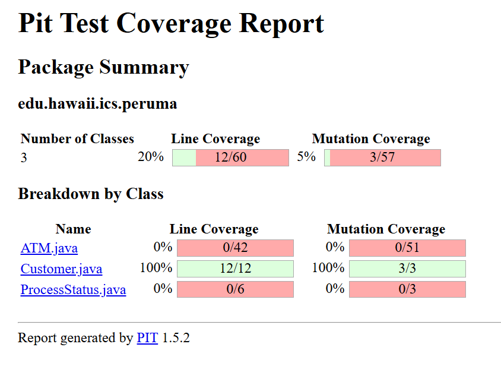

mvn clean clover:setup test clover:aggregate clover:clover

mvn test-compile org.pitest:pitest-maven:mutationCoverage

Below is my java code for 3 files can you generate the test cases so that the coverage is atleast 86% but can be more than this. 

The above are java files for atm,customer and processstatus

Can you also generate for customer and processstatus

I dont have jupiter plugin installed so keep it simple and do coverage more than 86 for all the 3 snippets you have generated above
