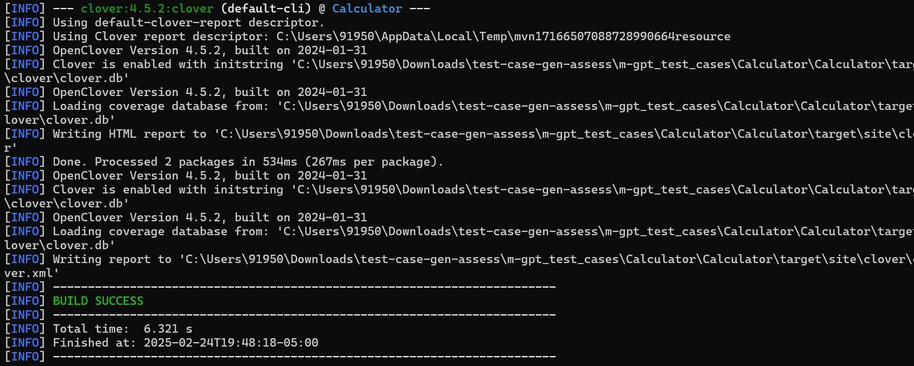
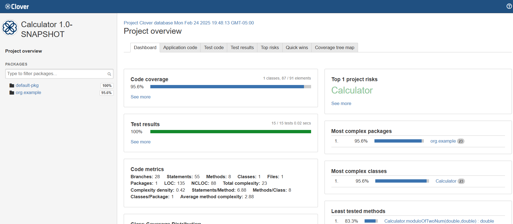
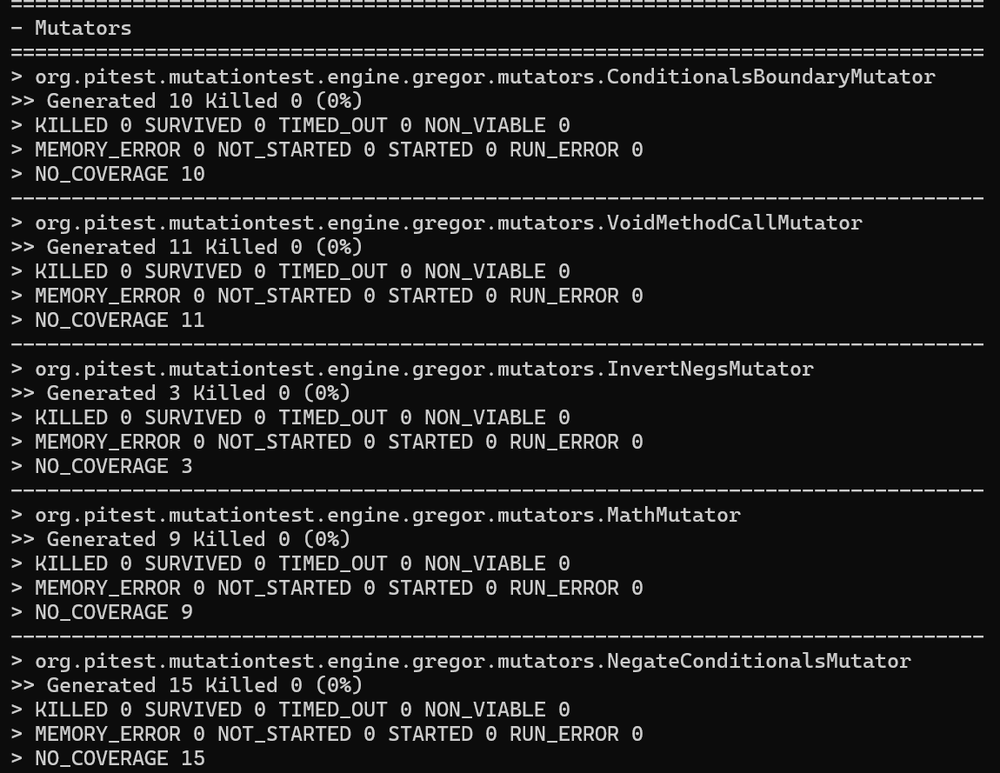
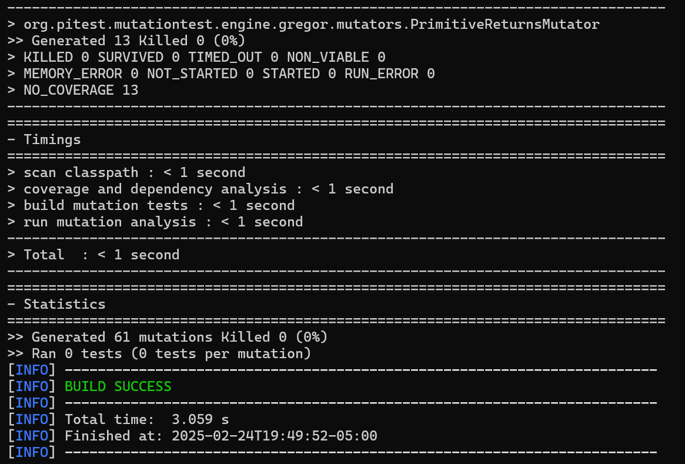
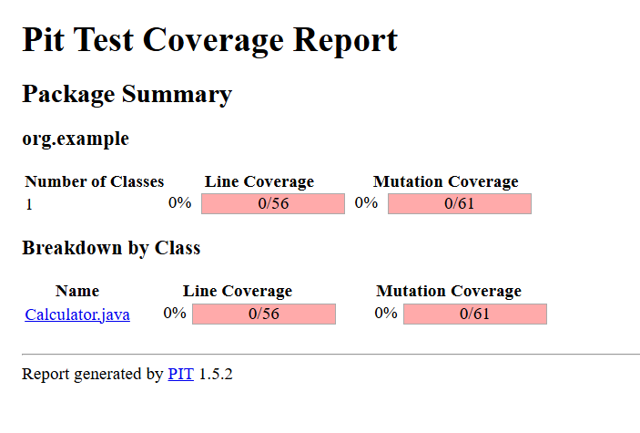

mvn clean clover:setup test clover:aggregate clover:clover

mvn test-compile org.pitest:pitest-maven:mutationCoverage

have the context before (ATM test cases)

This is my java code for calculator class can you write unit test cases with coverage greater than 86% 

