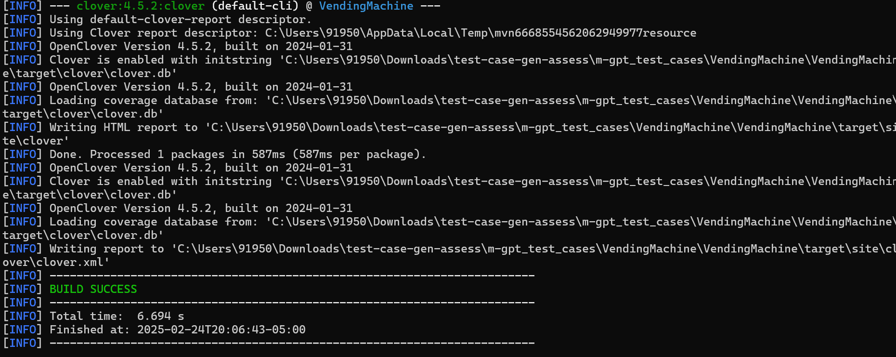
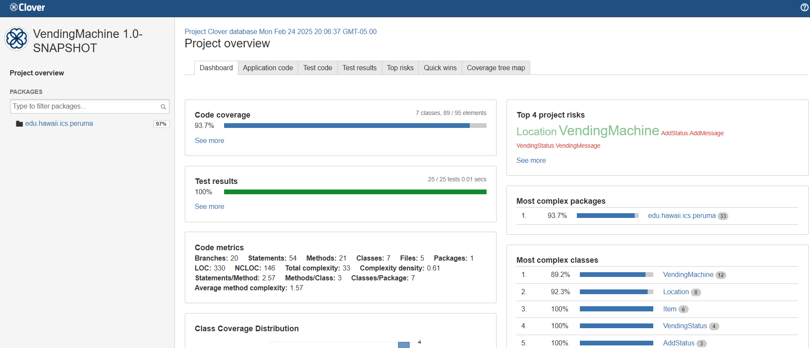
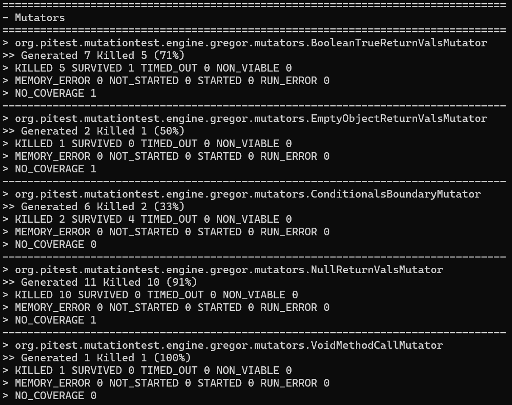
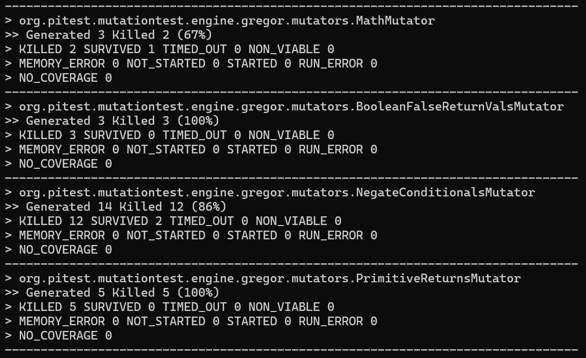
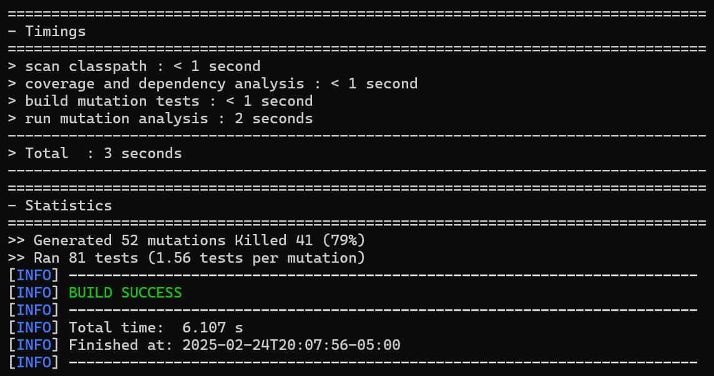
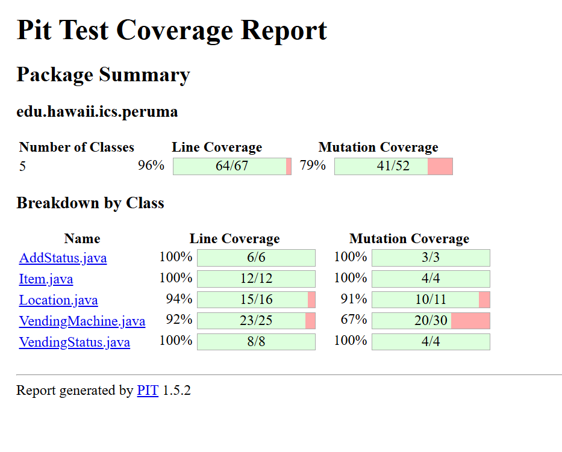

these are my java files for add status, item, location, vendingmachine and vending status can you generate unittests for each file with coverage greater than 86%

have the before context

mvn clean clover:setup test clover:aggregate clover:clover

mvn test-compile org.pitest:pitest-maven:mutationCoverage

