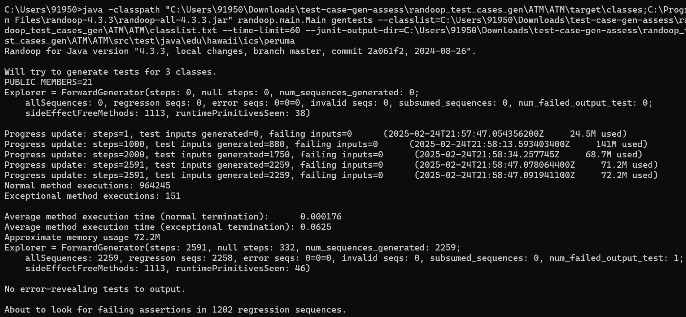
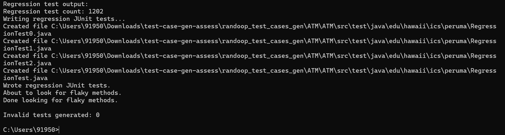
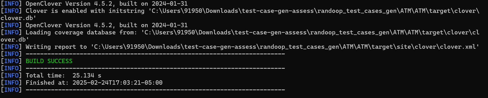
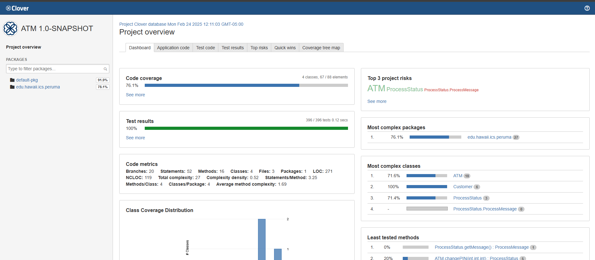
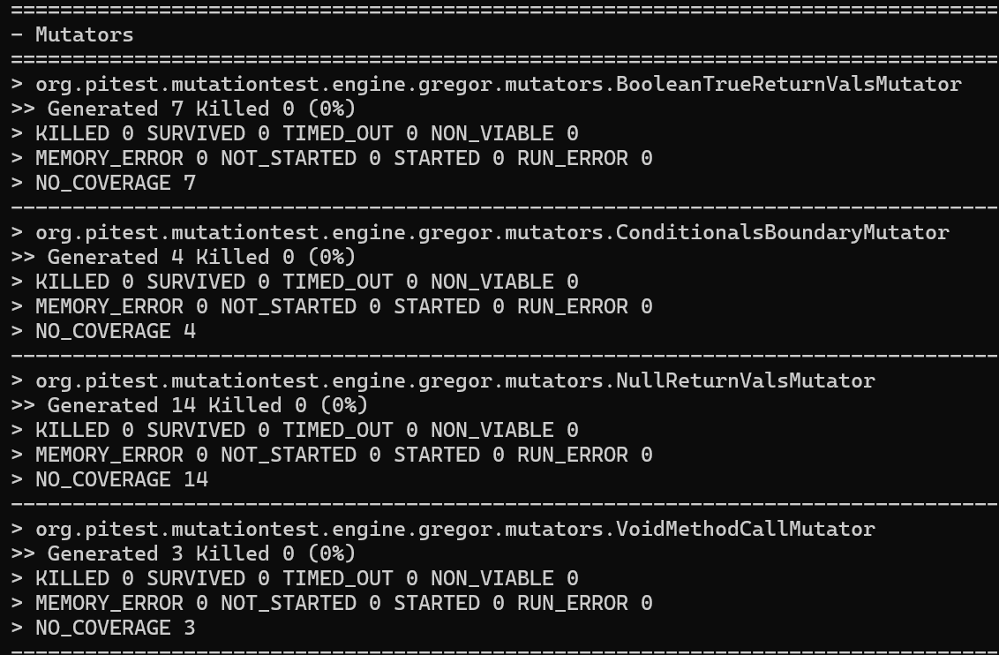
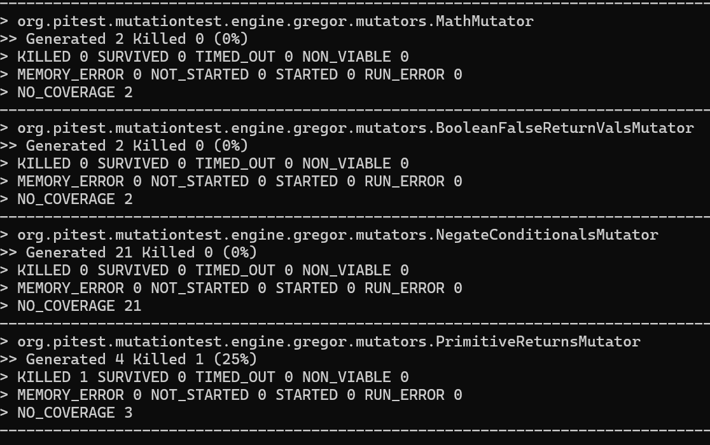
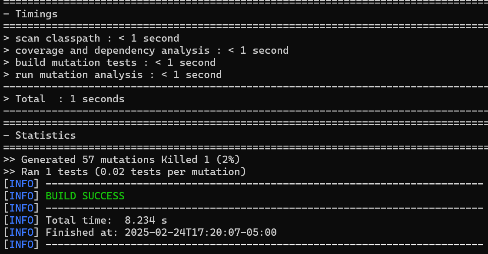
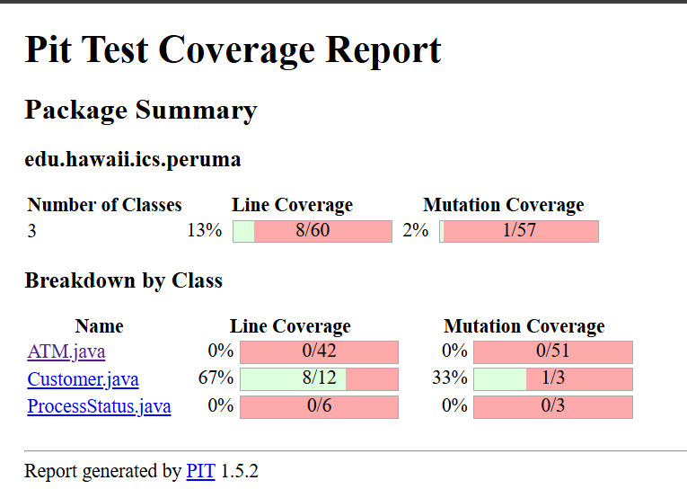

Randoop and Open Clover

Install Randoop and openclover, prerequisites: java and maven in systsem
C:\Users\91950\Downloads\test-case-gen-assess\randoop_test_cases_gen\ATM\ATM

java -classpath "C:\Users\91950\Downloads\test-case-gen-assess\randoop_test_cases_gen\ATM\ATM\target\classes;C:\Program Files\randoop-4.3.3\randoop-all-4.3.3.jar" randoop.main.Main gentests --classlist=C:\Users\91950\Downloads\test-case-gen-assess\randoop_test_cases_gen\ATM\ATM\classlist.txt --time-limit=60 --junit-output-dir=C:\Users\91950\Downloads\test-case-gen-assess\randoop_test_cases_gen\ATM\ATM\src\test\java\edu\hawaii\ics\peruma

Clover plugin in maven https://central.sonatype.com/artifact/org.openclover/clover-maven-plugin/4.5.2/&smo=true

    <build>
        <plugins>
            <plugin>
                <groupId>org.openclover</groupId>
                <artifactId>clover-maven-plugin</artifactId>
                <version>4.5.2</version>
            </plugin>
        </plugins>
    </build>

Go to C:\Users\91950\Downloads\test-case-gen-assess\randoop_test_cases_gen\ATM\ATM\target\site\clover\index.html

Right click to open with any browser and you can see the test reports.

View Reports in target/site/clover/index.html.

By default the target folder will not be added to github makesure you build when you clone this repo

for mutation testing add the below plugin in pom.xml https://pitest.org/quickstart/maven/

    <plugin>
        <groupId>org.pitest</groupId>
        <artifactId>pitest-maven</artifactId>
        <version>1.5.2</version>
    </plugin>

mvn test-compile org.pitest:pitest-maven:mutationCoverage

