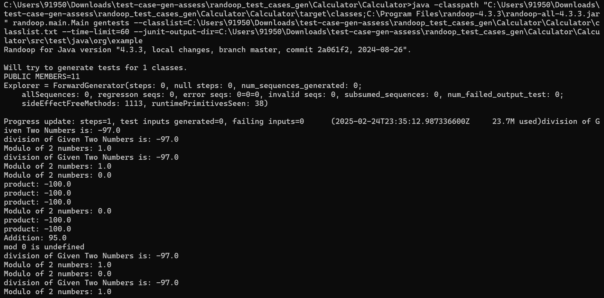

java -classpath "C:\Users\91950\Downloads\test-case-gen-assess\randoop_test_cases_gen\Calculator\Calculator\target\classes;C:\Program Files\randoop-4.3.3\randoop-all-4.3.3.jar" randoop.main.Main gentests --classlist=C:\Users\91950\Downloads\test-case-gen-assess\randoop_test_cases_gen\Calculator\Calculator\classlist.txt --time-limit=60 --junit-output-dir=C:\Users\91950\Downloads\test-case-gen-assess\randoop_test_cases_gen\Calculator\Calculator\src\test\java\org\example

