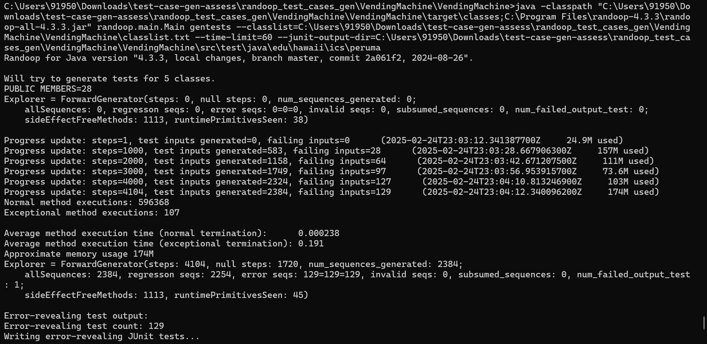
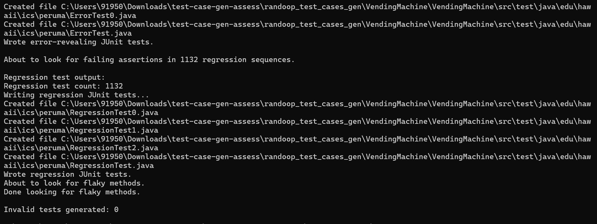
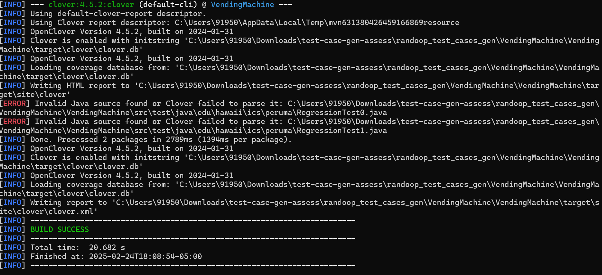
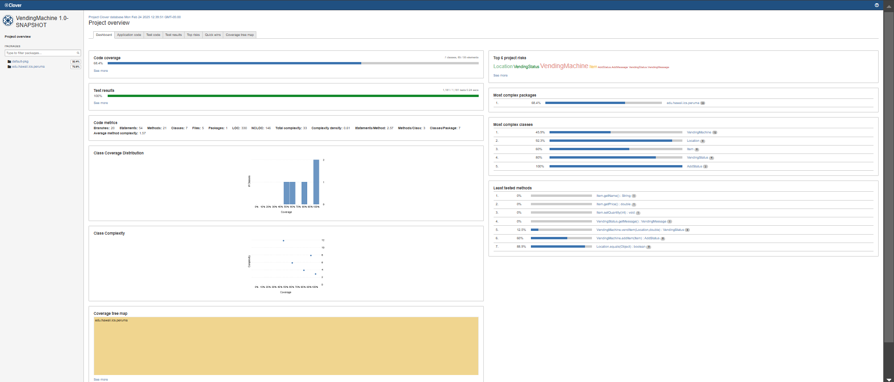
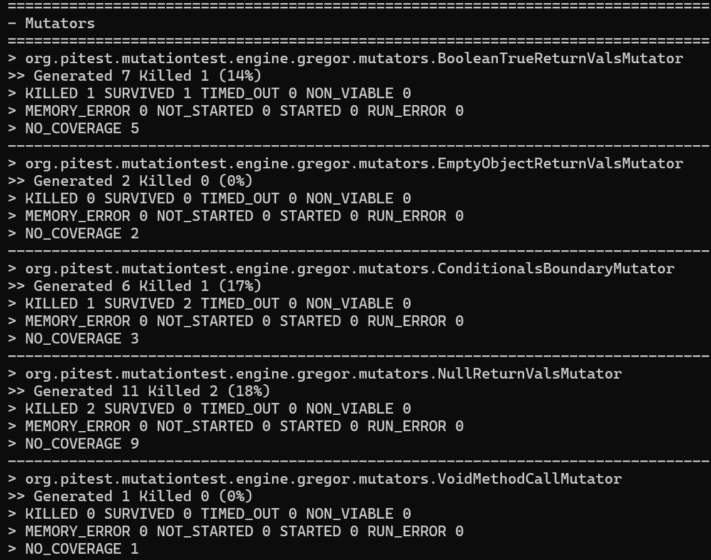
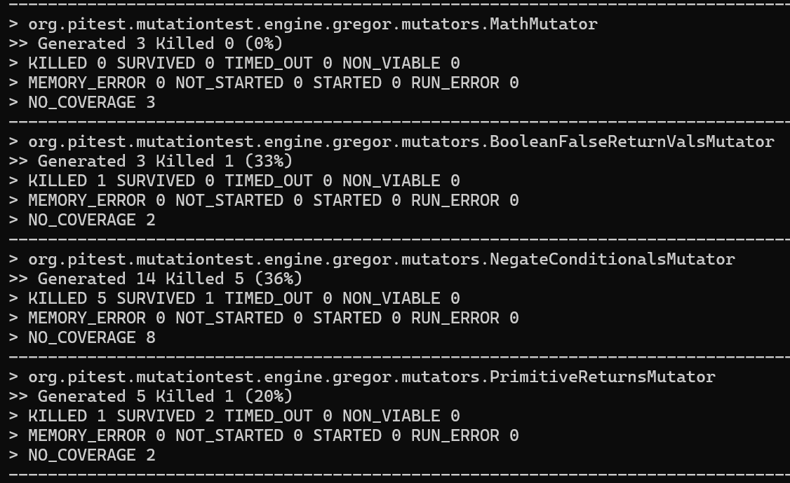
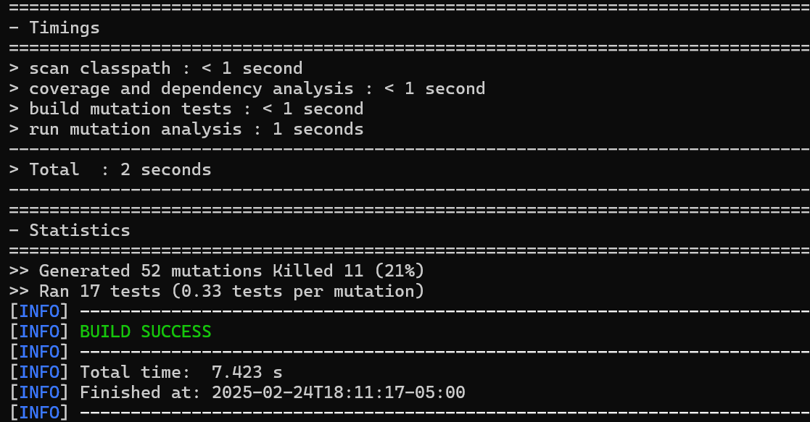
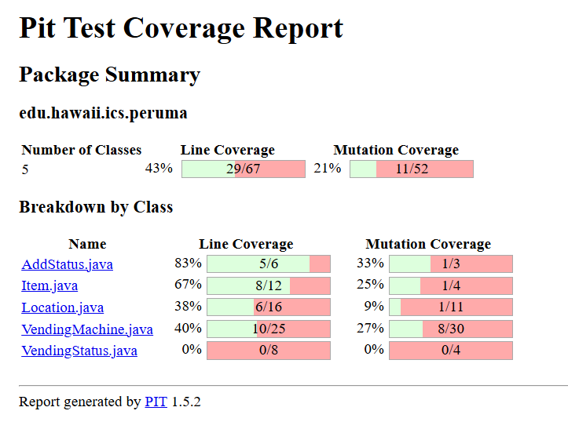

java -classpath "C:\Users\91950\Downloads\test-case-gen-assess\randoop_test_cases_gen\VendingMachine\VendingMachine\target\classes;C:\Program Files\randoop-4.3.3\randoop-all-4.3.3.jar" randoop.main.Main gentests --classlist=C:\Users\91950\Downloads\test-case-gen-assess\randoop_test_cases_gen\VendingMachine\VendingMachine\classlist.txt --time-limit=60 --junit-output-dir=C:\Users\91950\Downloads\test-case-gen-assess\randoop_test_cases_gen\VendingMachine\VendingMachine\src\test\java\edu\hawaii\ics\peruma

Remove error tests because it will fail 

Doing clover

mvn clean clover:setup test clover:aggregate clover:clover

Mutation testing

mvn test-compile org.pitest:pitest-maven:mutationCoverage

